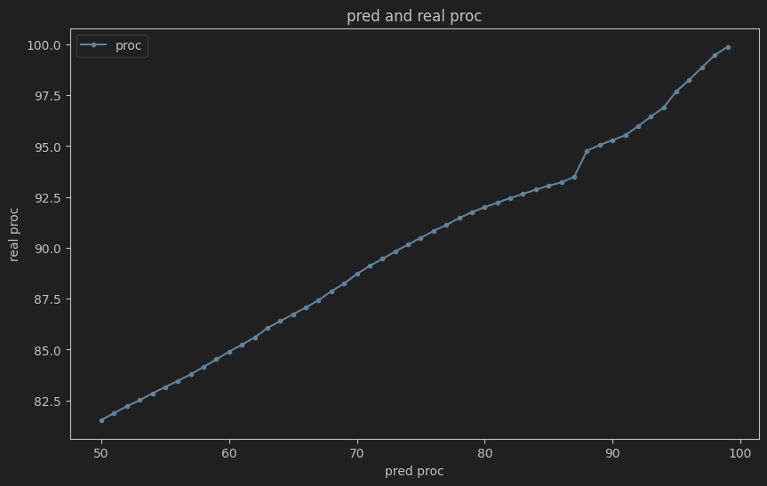

# Index_guess_up_or_down_with_nn

有个猜涨跌的活动，在每天1点前预测当天上证指数的涨跌，刚好最近在学神经网络，因此就想训练模型训练一下相关性。

先说结论：分别使用MLP、RNN、GRU、LSTM，在测试集上只获得了81%的正确率


这里主要介绍how to run，有关代码的运行结果可以看  https://zhuanlan.zhihu.com/p/710089577


## 运行

### 运行环境

Python 3.10.1


### 数据集

链接: https://pan.baidu.com/s/1QlCrU89CsLDjSfSiX3gfmw 提取码: ce6v


然后修改 data_process.py 中的

```python
pre_process_file_dir = "D:/data/stock_market/Index/"
```

为正确的路径


### train

```python
batch_size = 65536
input_size = 121
hidden_size = 512
output_size = 2
num_hidden_layers = 20
learning_rate = 2e-3
num_epochs = 100
max_load_data = 20000000
weight_decay_rate = 0.0
model_type = "MLP"  # MLP, MLP_Residual, MLP_Tanh, RNN, GRU, LSTM
is_used_loccode = True
is_used_Data_norm = True
```

* 可调的超参数如上，可忽略 MLP_Residual, MLP_Tanh 两个model


```python
        for data, labels in train_loader:
            data, labels = data.to(device), labels.to(device)
        # prefetcher = my_data_process.data_prefetcher(train_loader)
        # data, labels = prefetcher.next()
        # while data is not None:
            # 前向传播
            outputs = model(data)
            loss = torch.nn.functional.cross_entropy(outputs, labels)
            with torch.no_grad():
                _, predicted = torch.max(outputs, 1)
                predicted_label = torch.nn.functional.one_hot(predicted).to(device)
                total += labels.size(0)
                correct += (predicted_label == labels).sum().item() / 2

            optimizer.zero_grad()
            loss.backward()
            optimizer.step()
            scheduler.step()
            total_loss += loss.item()
            # data, labels = prefetcher.next()
```

* 当前代码使用cpu训练会报错，需要修改 train.py 中的 train_loop 和 eval_model 两个函数，示例如上


### reason

预测当天的指数涨跌类型


```
today 2024-07-21 is not TradeDay
```

* 如果是非工作日则不会运行


```
today = today - datetime.timedelta(days=2)
```

* 可以通过手动修改日期来测试


```
2024-07-19
0 26.45% 73.55% -0.08% True False
1 86.12% 13.88% 0.83% True True
```

* 字段含义是 指数类别 涨的概率 跌的概率 到当天中午的涨跌幅度 预测的值是否和当前涨跌方向一致 预测的值是否和真实值一致(如果是历史数据会有这一项)

* 0 1 分别由`index_name_list = ["sh000001", "sz399808"]` 定义

	

当前默认的模型 `MLP_e_4_tiran_80.5_test_81.6_val_85.7_is_121_hs_512_nh_20_bs_65536_lr_0.002_wd_0.0_ds_20000000_model_weights.bin` 的预测概率如下



* 可以看出预测的概率和真实概率之前存在线性关系，对比的是 2024-05-1-> 2024-06-14 之间的测试集
